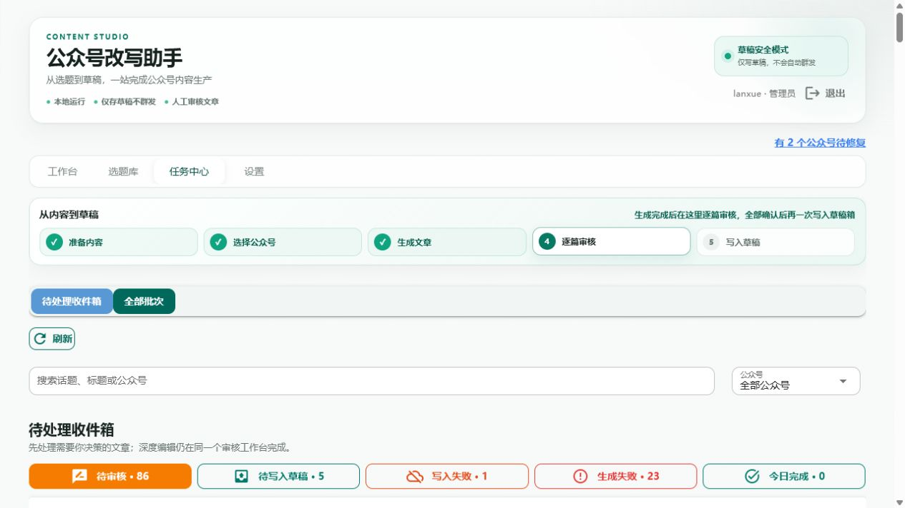
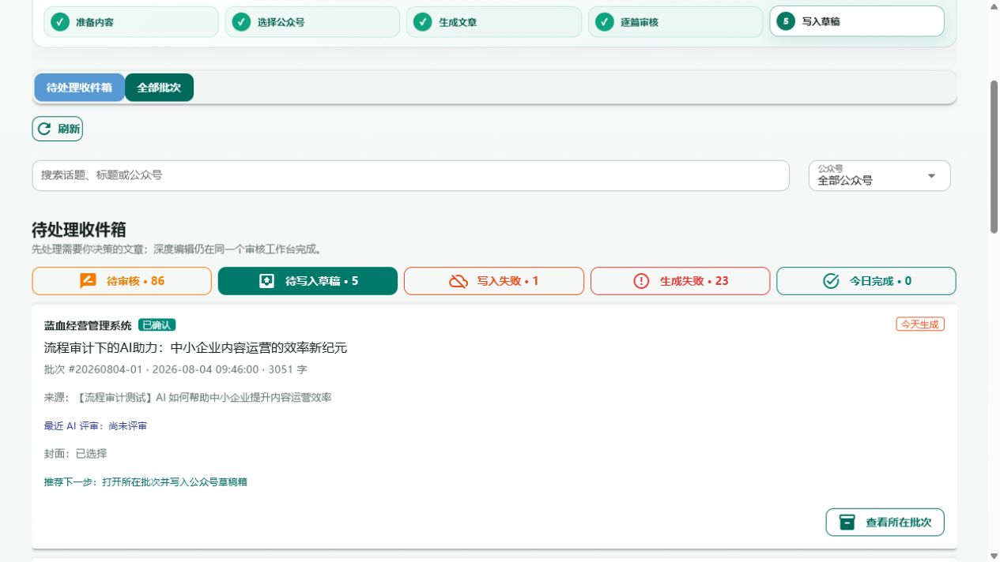
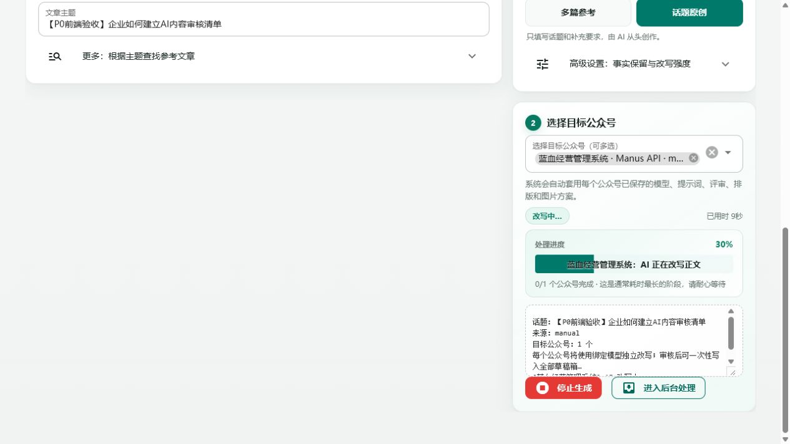
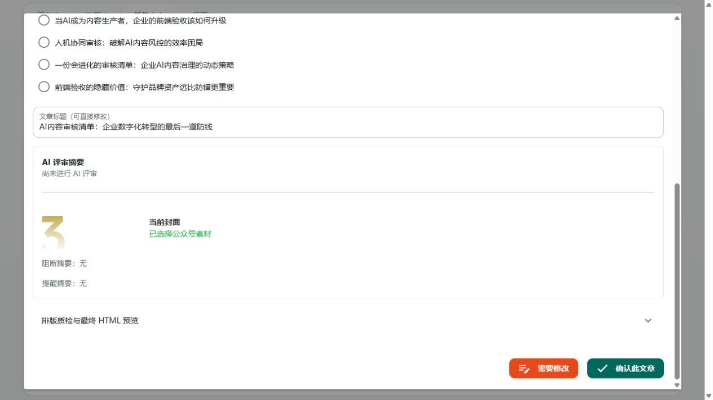
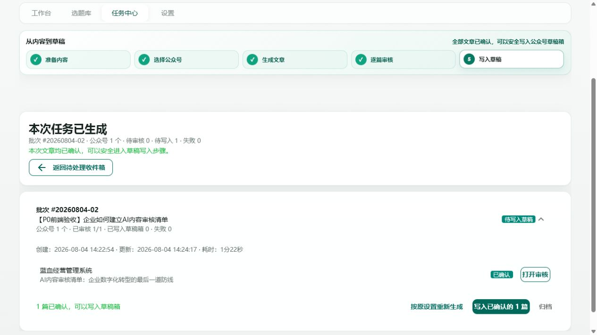
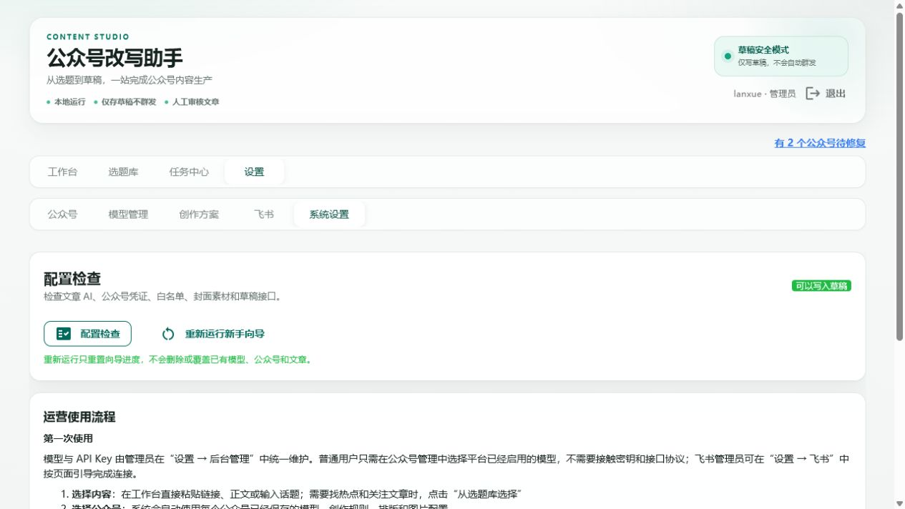
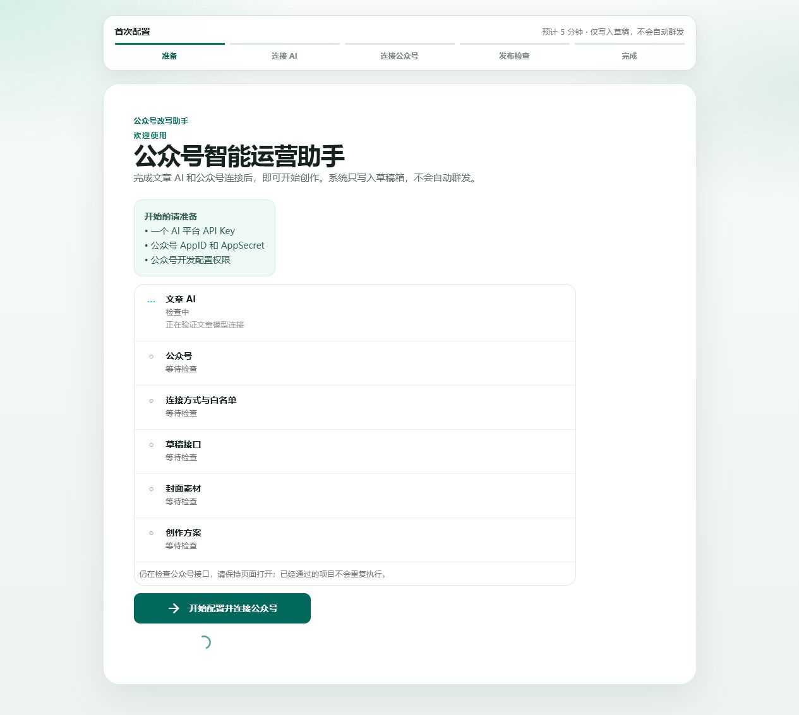
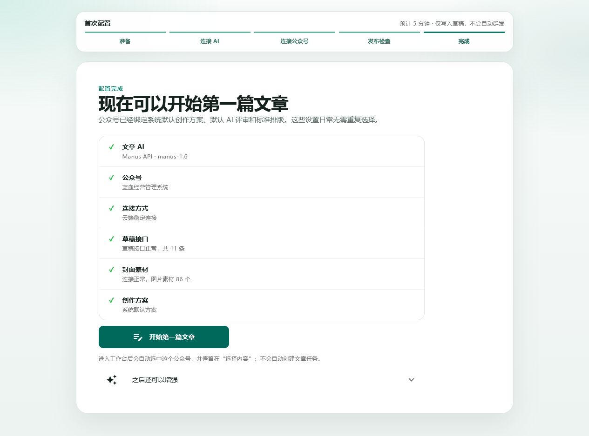

# 三项 P0 前端验收记录

- 日期：2026-08-04
- 验收方式：本地真实前端、1280×720 视口、管理员实际登录
- 核心测试批次：`#20260804-02`
- 测试话题：`【P0前端验收】企业如何建立AI内容审核清单`
- 安全边界：实际调用文章模型并完成审核确认；未点击“写入已确认的 1 篇”，未向微信公众号草稿箱写入数据

## 一、结论

三项 P0 均存在真实可见的前端入口，且核心状态转换已通过浏览器操作验证，不是只验证 API 或服务层。

| P0 | 前端入口 | 验收结果 |
| --- | --- | --- |
| 待审核与待写入状态统一 | `任务中心 → 待写入草稿`、本次批次卡、顶部步骤条 | **通过** |
| 生成完成聚焦本次任务 | 生成成功后自动出现“本次任务已生成” | **通过** |
| 配置检查分项反馈 | `设置 → 系统设置 → 重新运行新手向导 → 我已经配置过，自动检查` | **通过** |

## 二、前端验收步骤

### Step 1｜任务中心收件箱入口｜健康度：通过

- 页面可见“待审核、待写入草稿、写入失败、生成失败、今日完成”五个独立入口。
- 本次数据中“待写入草稿”为 5 条，不依赖接口调试工具才能发现。
- 1280×720 下五个入口均在首屏可见。

### Step 2｜待写入草稿列表与步骤条｜健康度：通过

- 点击“待写入草稿”后，顶部流程切换到第 5 步“写入草稿”。
- 已确认文章显示“已确认”和“查看所在批次”。
- 页面不再展示“快速审核”或“深度编辑”，避免重复审核。
- 推荐下一步明确为“打开所在批次并写入公众号草稿箱”。

### Step 3｜真实生成过程｜健康度：通过

- 通过工作台实际选择“话题原创”和 1 个公众号并启动生成。
- 页面持续显示公众号、阶段、进度、用时、“停止生成”和“进入后台处理”。
- 批次最终生成成功，耗时 1 分 22 秒。

### Step 4｜本次任务完成聚焦页｜健康度：通过

- 生成完成后自动进入任务中心，并展示“本次任务已生成”。
- 首屏只展示批次 `#20260804-02`，没有渲染历史文章列表。
- 页面提供“审核第 1 篇”和“返回待处理收件箱”。
- 摘要正确显示公众号 1 个、待审核 1、待写入 0、失败 0。

### Step 5｜一次点击进入审核｜健康度：通过

- 点击“审核第 1 篇”后直接打开同一篇文章的审核工作台。
- 前端保留标题选择、文章标题、封面、质检预览、“需要修改”和“确认此文章”入口。
- 未发生跳回历史收件箱或要求用户再次寻找本批次。

### Step 6｜确认后进入待写入草稿｜健康度：通过

- 点击“确认此文章”后，弹窗关闭并原地刷新本次批次。
- 顶部步骤条从“逐篇审核”切到“写入草稿”。
- 摘要从“待审核 1、待写入 0”变为“待审核 0、待写入 1”。
- 批次卡显示“已审核 1/1”“待写入草稿”“已确认”。
- 页面保留“写入已确认的 1 篇”入口，但本次未点击。

### Step 7｜配置检查的长期入口｜健康度：通过

- 管理员可从“设置 → 系统设置”找到“配置检查”和“重新运行新手向导”。
- 页面明确说明重开向导不会删除或覆盖模型、公众号和文章。
- 这保证首次配置完成后，运营仍能重新进入检查流程，不是一次性隐藏入口。

### Step 8｜六项增量检查｜健康度：通过

- 点击“我已经配置过，自动检查”后约 **412ms** 出现六项列表，满足 500ms 验收要求。
- 六项分别为文章 AI、公众号、连接方式与白名单、草稿接口、封面素材、创作方案。
- 文章 AI 进入“检查中”，其余项目保持“等待检查”；页面逐项更新，不是统一 loading 弹层。
- 检查超过 10 秒时，页面显示“仍在检查公众号接口，请保持页面打开”。

### Step 9｜配置检查完成｜健康度：通过

- 六项最终全部通过，结果和接口数量、素材数量可见。
- 页面提供“开始第一篇文章”，点击后恢复正常工作台并清除强制重开状态。
- 配置检查完成后没有自动创建文章任务。

## 三、前端质量判断

### 已确认的优势

- 三个 P0 都有面向运营人员的入口和下一步动作，不依赖接口或数据库操作。
- “确认文章 → 待写入草稿”的指标、步骤条、批次状态和 CTA 同步变化。
- 生成完成聚焦页成功隔离了历史积压，单公众号一次点击即可进入审核。
- 六项检查在真实浏览器中按项目出现，且达到 500ms 内展示的要求。
- 本轮浏览器控制台未发现应用前端错误。

### 非阻断风险

- 审核工作台内容较长，内部文章预览与外层弹窗仍存在双滚动；这是原审计中的 P1，不影响本轮 P0 入口验收。
- 本次现有配置全部健康，因此没有在真实账号环境中故意破坏凭证来触发“重试本项 / 去修复”；相关按钮已由前端组件测试覆盖，但故障态仍建议在隔离账号中补一次浏览器演练。
- “全部批次”同时包含不同阶段时，顶部步骤条保持任务中心默认阶段；单批次准确阶段以完成态、待写入收件箱和批次卡为准。

## 四、可访问性与证据边界

- 截图证明入口、文案和状态可见，但不能证明读屏顺序和完整键盘操作。
- 本轮没有做 200% 缩放、移动端或高对比度模式测试。
- 生成、审核和状态切换使用真实前端；真实微信公众号草稿写入仍未执行。
- 临时普通用户已删除，临时预览服务已关闭；测试批次 `#20260804-02` 保留为验收证据。
