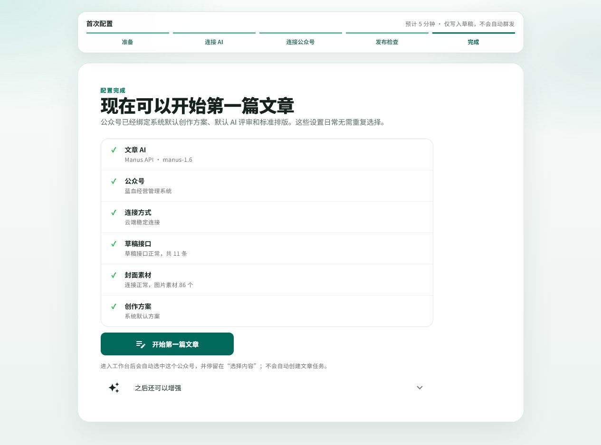
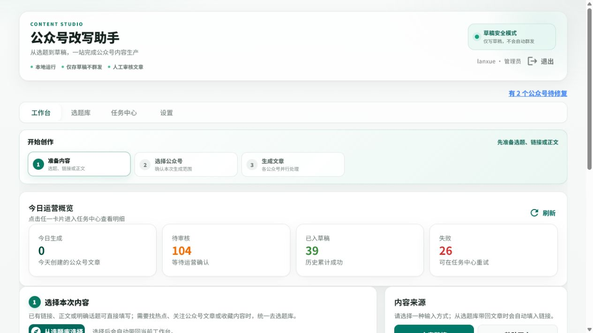
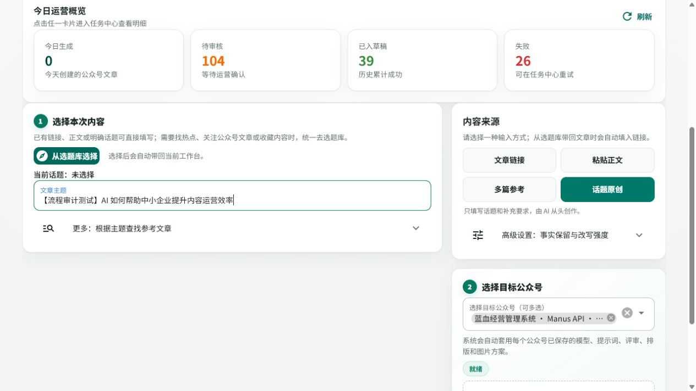
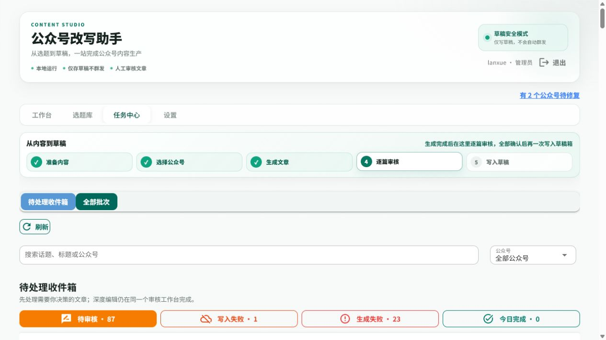
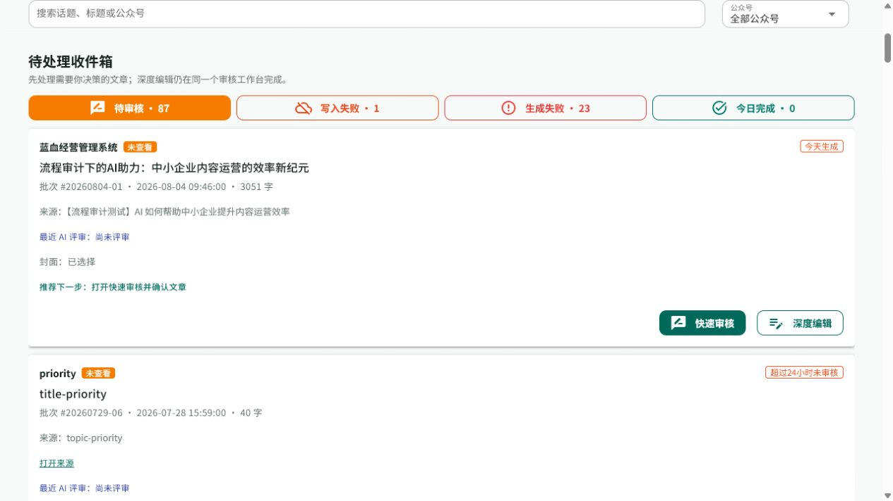
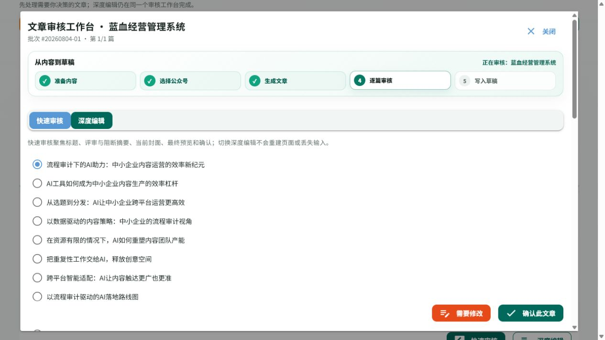
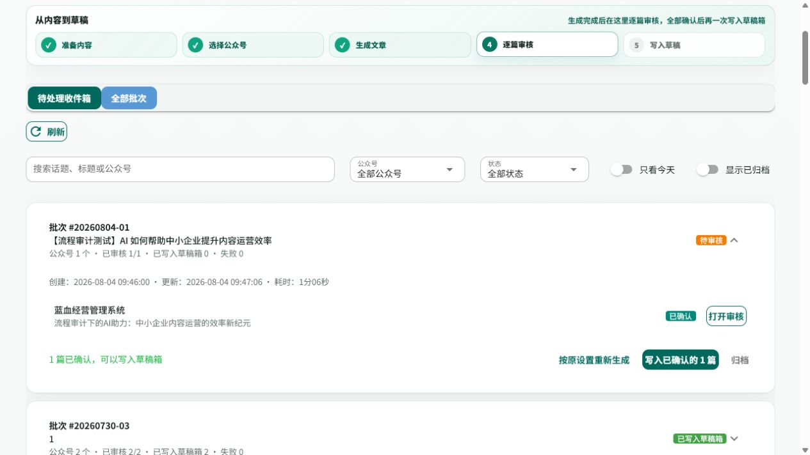

# 公众号智能运营助手：使用流程审计与优化建议

- 审计日期：2026-08-04
- 核心任务：运营人员首次登录，完成一篇文章的生成与审核
- 实测边界：已创建批次 `#20260804-01`，完成 1 篇文章确认，停在“写入已确认的 1 篇”之前
- 证据标记：**实际体验**＝本次真实操作；**代码/现有文档发现**＝项目资料核对；**竞品公开资料研究**＝竞品官方页面研究

## 一页结论

产品已经具备完整、可信的内容生产闭环，尤其是“只写草稿、不自动群发”、配置预检、逐篇人工审核和失败恢复，安全感明显强于普通 AI 写作工具。当前主要问题不是功能缺失，而是**状态、入口与信息优先级没有围绕运营人员的下一步决策收束**。

最值得优先解决的 5 个问题：

1. **审核状态自相矛盾（P0）**：文章已经“已确认”、批次显示“已审核 1/1”，批次角标仍是“待审核”。运营人员无法确定能否安全写入草稿。
2. **生成完成后仍被历史积压淹没（P0）**：系统自动进入任务中心，但页面先展示 87 篇待审核历史文章；本次任务虽排在第一位，仍需要再次识别和点击。
3. **首次配置检查缺少分项进度（P0）**：本次自动检查约等待 18 秒，期间只有统一等待提示，容易被误判为卡死。
4. **工作台首屏信息过重（P1）**：首次用户先看到 104 篇待审核、39 篇已入草稿、26 篇失败，再看到内容输入区；历史负担压过“开始第一篇文章”。
5. **审核决策负担偏高（P1）**：快速审核一次给出 10 个标题，未提供排序原因或差异说明；大型弹窗同时存在外层和预览区滚动。

六个运营维度的当前判断：

| 维度 | 健康度 | 结论 |
| --- | --- | --- |
| 首次成功率 | 中 | 向导完整，但长等待无进度，工作台又被历史数据打断 |
| 日常操作步数 | 良好 | 从话题到审核约 5 个关键动作，生成后能自动跳转 |
| 多账号效率 | 良好 | 一次选择多公众号、各自套用方案，批次管理清楚 |
| 审核安全 | 优秀 | 明确人工确认，真实草稿写入前有独立动作 |
| 异常恢复 | 良好 | 有失败分类、失败重试、重新生成和错误复制 |
| 功能可发现性 | 中 | 能力很多，但入口、状态和优先级容易互相争夺注意力 |

## 当前核心流程审计

### 1. 登录｜健康度：良好

- **优势（实际体验）**：登录前就说明“统一 AI 模型、只写草稿、不自动群发”，降低新用户对密钥和误发布的担心。
- **问题（实际体验）**：桌面端卡片过窄，右侧出现大面积空白；默认管理员账号直接展示，只适合开发或私有部署环境。
- **建议**：生产环境移除默认账号提示；桌面端使用 440–520px 居中卡片或双栏布局。

### 2. 首次配置入口｜健康度：需要优化

- **优势（实际体验）**：明确告知预计时间、所需材料和安全边界；“首次配置”和“已有配置自动检查”两条路径清楚。
- **问题（代码/现有文档发现）**：管理员才自动进入完整向导；现有交接稿指出普通新用户可能直接进入没有公众号的工作台。
- **建议**：所有角色都先进入“可开始创作吗”的就绪判断；管理员负责配置，普通用户看到明确的申请/等待状态。

### 3. 配置检查与完成｜健康度：良好，但等待反馈不足

- **优势（实际体验）**：一次检查文章 AI、公众号、连接方式、草稿接口、封面素材和创作方案，结果可读且可信。
- **问题（实际体验）**：自动检查约 18 秒，只显示统一等待弹层，没有分项状态或剩余预期。
- **建议**：检查开始即展示 6 个项目，逐项显示“等待/检查中/通过/失败”；超过 10 秒显示“仍在检查”，单项失败可重试。

### 4. 工作台准备内容｜健康度：需要优化

- **优势（实际体验）**：支持链接、正文、多篇参考和话题原创；选中内容和公众号后，顶部步骤会立即变为完成状态。
- **问题（实际体验）**：首次进入先看到大量历史指标；“有 2 个公众号待修复”没有说明是否影响当前已选公众号。
- **问题（实际体验）**：内容输入区与来源选择区分列，填写主题后仍需确认右侧模式，视线和操作路径来回移动。
- **建议**：首次成功前折叠历史概览；内容来源选择和对应输入框保持同一列；配置告警改为“当前账号可用 / 另有 2 个账号待修复”。

### 5. 生成文章｜健康度：良好

- **优势（实际体验）**：本次生成耗时 1 分 06 秒；页面持续显示公众号、阶段、百分比、用时和停止按钮，等待有掌控感。
- **优势（实际体验）**：生成完成后自动进入任务中心，不要求用户手动刷新或寻找批次。
- **问题（实际体验）**：百分比从 38% 快速跳到 91%，更像阶段权重而非真实剩余时间，应避免让用户按线性进度理解。
- **建议**：保留阶段进度，弱化“精确百分比”，增加“预计还需约 30–60 秒”或历史区间。

### 6. 任务中心收件箱｜健康度：需要优化

- **优势（实际体验）**：新任务排在第一位，卡片给出来源、字数、封面、AI 评审状态和推荐下一步。
- **问题（实际体验）**：页面同时展示 87 篇待审核、1 篇写入失败和 23 篇生成失败；新任务完成的正反馈被历史积压削弱。
- **建议**：生成完成先进入“本次任务完成”聚焦态，主按钮直接打开第 1 篇审核；历史收件箱作为次级入口。

### 7. 快速审核｜健康度：需要优化

- **优势（实际体验）**：标题、AI 评审、封面、阻断摘要、排版质检和最终预览都集中在一个工作台；确认动作明确。
- **问题（实际体验）**：一次呈现 10 个标题，没有评分、差异标签或推荐理由；快速审核仍需要长距离滚动。
- **问题（实际体验）**：弹窗外层与文章预览区均可滚动，键盘焦点顺序和读屏体验存在风险，截图无法确认完整可访问性。
- **建议**：默认展示 3 个推荐标题并说明“信息型/观点型/传播型”，其余收进“查看更多”；保留单一主滚动区和底部固定确认栏。

### 8. 审核完成与草稿边界｜健康度：存在 P0 状态风险

- **优势（实际体验）**：文章显示“已确认”，并明确提示“1 篇已确认，可以写入草稿箱”；真实写入仍需独立点击。
- **问题（实际体验）**：同一批次同时出现“已审核 1/1”“已确认”和“待审核”三个互相冲突的状态。
- **本次边界**：未点击“写入已确认的 1 篇”，没有向真实微信公众号写入草稿。

## 竞品启发（官方公开资料研究）

本次没有注册、扫码或使用付费试用。审计环境访问三家站点时连续超时，因此以下属于**竞品公开资料研究，不是后台亲测**。

| 产品 | 公开流程特征 | 对本产品的启发 |
| --- | --- | --- |
| [壹伴](https://yiban.io/help) | 浏览器插件直接运行在公众号后台；把采集、AI 写作、标题优化、排版、违规检测和数据分析放在微信编辑场景内 | 减少跨系统切换；本产品应在任务卡和审核页持续保留“来源—账号—草稿”的上下文，而不是继续增加独立设置页 |
| [135 编辑器](https://www.135editor.com/books/chapter/1/25) | 先授权公众号，再要求标题、封面和目标账号；支持保存同步、插件同步和复制使用三条路径；同步失败有专门说明 | 把写入草稿的必备条件显式列在 CTA 前，并为每项给出修复入口；不必照搬多种同步方式 |
| [小豆芽](https://xdouya.com/) | 围绕团队空间、账号分组、作品管理、一对多发布和数据导出组织矩阵运营 | 多公众号选择应进一步支持账号组和常用组合，减少每天重复勾选 |

值得借鉴、但不应照搬的原则：

- 借鉴壹伴的“工作发生在哪里，工具就出现在哪里”，强化上下文，不增加更多一级导航。
- 借鉴 135 的“同步前条件可见”，把封面、审核、公众号连接和写入权限汇总到最后一步。
- 借鉴小豆芽的账号分组，但保持本产品“公众号专属方案 + 人工审核 + 只写草稿”的差异化。

## 优化清单

### P0：先消除误判和首次流失

| 优化项 | 具体方案 | 预期收益 | 验收标准 |
| --- | --- | --- | --- |
| 统一批次状态口径 | 用文章子状态计算唯一批次状态：失败处理中、生成中、待审核、待写入草稿、写入中、已写入；全部文章确认且未写入时必须是“待写入草稿” | 避免重复审核、误认为任务未完成 | `已审核 1/1 + 失败 0 + 已写入 0` 时，收件箱、批次卡、步骤条统一显示“待写入草稿”，不再出现“待审核” |
| 生成完成后聚焦本次任务 | 自动跳转后先展示本批次成功摘要和“审核第 1 篇”；历史待办收起到“返回收件箱” | 提高首次成功率和连续操作率 | 单公众号生成成功后，用户 1 次点击即可进入审核；首屏不出现其他历史文章 |
| 配置检查分项反馈 | 6 个检查项逐条更新；10 秒提示仍在检查，30 秒单项超时；失败项提供原位重试和修复入口 | 降低等待焦虑和重复点击 | 点击自动检查后 500ms 内出现分项列表；任一项失败不会清空已通过结果 |

### P1：降低日常运营决策成本

| 优化项 | 具体方案 | 预期收益 | 验收标准 |
| --- | --- | --- | --- |
| 精简工作台首屏 | 首次成功前折叠历史 KPI；把内容来源与对应输入放在同一区域；高级设置默认收起 | 让“开始一篇文章”成为唯一主任务 | 1280×720 下，主题/来源、目标公众号和开始生成按钮无需滚动即可看见 |
| 标题候选分层 | 默认展示 3 个推荐标题，分别标注风格和推荐理由；其余标题放入展开区 | 缩短比较时间 | 默认可见标题不超过 3 个；每个标题至少有 1 个差异标签；展开后仍可选择全部候选 |
| 重构审核滚动与固定动作 | 快速审核采用单一主滚动区；确认/需要修改固定在底部；文章预览单独全屏打开或限定高度 | 避免迷失和误操作 | 任意滚动位置都能看到当前文章、审核进度和确认动作；弹窗关闭后返回原批次位置 |
| 明确指标语义 | 区分“今日生成、今日已审核、今日已写入”；待办分成“待审核”和“待写入” | 让运营知道工作真正完成到哪一步 | 确认文章后，“待审核”立即减 1，“待写入”加 1；指标帮助文案说明统计口径 |

### P2：为规模化运营提效

| 优化项 | 具体方案 | 验收标准 |
| --- | --- | --- |
| 账号组与常用组合 | 支持按品牌、客户或内容类型保存公众号组合，工作台一键选择 | 选择 5 个常用公众号不超过 2 次点击 |
| 优化桌面空间利用 | 登录和向导改为居中宽卡或双栏；减少无意义空白 | 1280px 宽度下主卡宽度不少于 440px，关键信息无需窄列换行 |
| 可访问性补测 | 为中文界面的删除/清空按钮提供中文名称；验证键盘焦点、弹窗焦点回收、对比度和 200% 缩放 | 纯键盘可完成登录、创建、审核和关闭弹窗；200% 缩放无关键内容丢失 |

## 五、建议的实施顺序

1. 先修复批次状态计算与各页面文案映射。
2. 再增加生成完成后的“本次任务”聚焦态，并同步调整待办指标。
3. 随后改造配置检查进度和工作台首屏。
4. 最后处理标题分层、审核滚动、账号组和可访问性。

这套顺序不改变生成、审核或微信接口，只先重组已有能力的反馈与入口，风险低，且能最快提升首次成功率与日常审核效率。

## 证据边界与未验证项

- 本次未点击真实草稿写入，无法验证微信草稿箱最终内容、接口等待和重复写入对账体验。
- 竞品未登录，未验证其后台性能、错误恢复、权限隔离或真实同步成功率。
- 截图只能发现可见的对比度、滚动和标签风险；键盘、读屏、缩放和响应式仍需单独测试。
