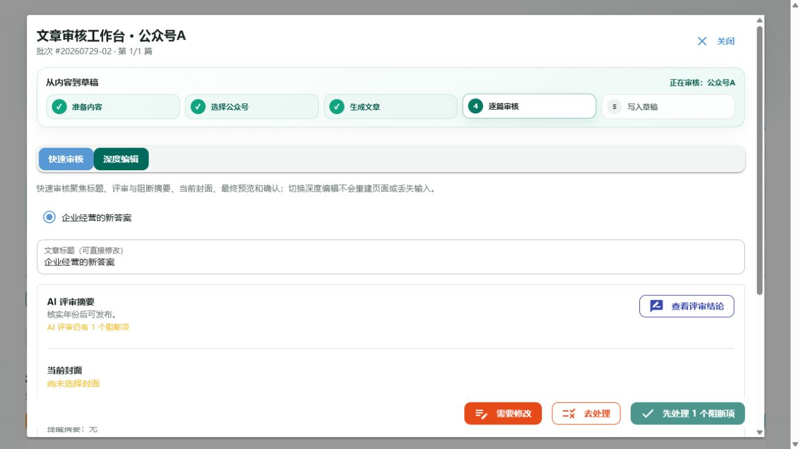
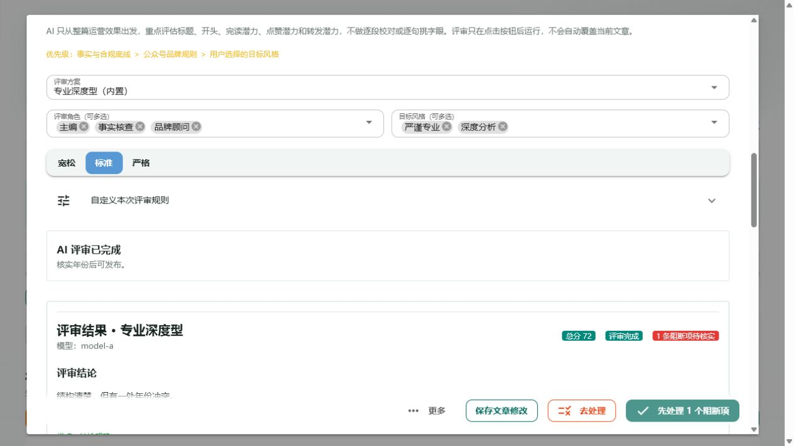
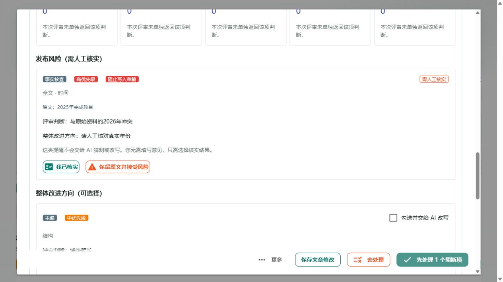
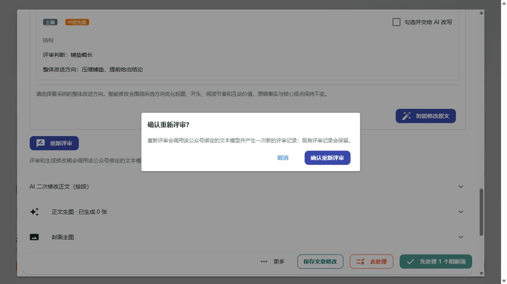
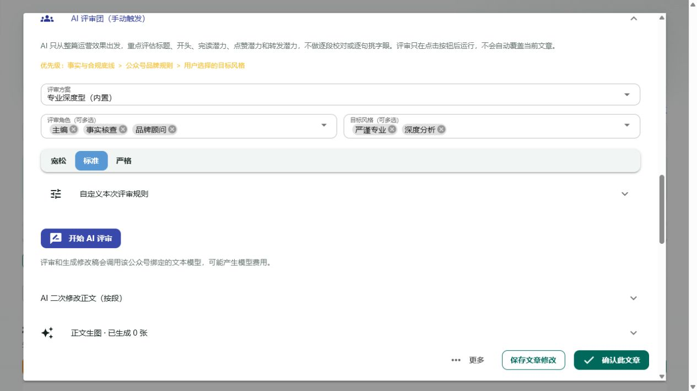

# AI 评审 P0 开发与前端验收记录

日期：2026-08-05
开发负责人：开发大管家 Turing
复核人：Codex 主代理
需求来源：`docs/codex/2026-08-05-AI评审流程审计.md`

## 实施结论

三项 P0 已完成代码调整，并通过相关自动化测试和真实前端验收：

1. “查看完整评审/查看评审结论”已收敛为唯一“查看评审结论”入口；一次点击可切换深度编辑、展开 AI 评审面板并滚动到结果。
2. AI 评审存在未处理阻断项时，底部确认按钮会显示“先处理 N 个阻断项”并禁用，同时提供“去处理”；风险操作按当前状态互斥显示。
3. 无业务结果的“使用原文”已删除；首次评审显示“开始 AI 评审”，已有评审显示“重新评审”，重新评审需要二次确认。

## 实际修改文件

- `app/ui/panels/review_jury.py`
  - 新增首次、进行中、重新评审按钮状态。
  - 新增重新评审确认弹窗。
  - 删除“使用原文”和深度面板内重复结论入口。
  - 风险按钮根据 `resolution` 状态互斥显示。
  - 风险处理、智能改写或评审完成后通知父工作台即时刷新门禁。
  - 对外返回统一的结果展开/滚动动作。
- `app/ui/panels/tasks.py`
  - 快速审核只显示唯一“查看评审结论”入口。
  - 点击后调用评审面板统一展开动作。
  - 新增前端确认门禁和“去处理”按钮。
  - 确认前再次读取最新评审状态，防止绕过前端门禁。
- `tests/test_ui_review_jury_contract.py`
  - 覆盖重复入口删除、无效按钮删除、风险操作互斥、启动状态和重评取消保护。
- `tests/test_ui_review_inbox.py`
  - 覆盖快速入口、确认门禁、“去处理”和确认接口调用顺序。

## 自动化验证

执行：

```text
python -m pytest \
  tests/test_ui_review_jury_contract.py \
  tests/test_ui_review_inbox.py \
  tests/test_editorial_reviews.py \
  tests/test_batch_review.py -q
```

结果：`95 passed in 20.79s`

全量回归：

```text
python -m pytest -q
```

结果：`827 passed, 6 warnings in 96.10s`。6 条均为第三方依赖弃用提示，没有测试失败。

其他检查：

- 相关 Python 文件 `py_compile`：通过。
- Ruff 致命错误和未定义引用规则 `F,E9`：通过。
- 本次涉及的新增导入排序 `I001`：通过。
- `git diff --check`：通过。
- 全量 Ruff 仍会报告这些历史大文件原有的 SIM、UP、DTZ、RUF 等规则债务；未把无关格式重构混入本次 P0。

## 真实前端验收

### 1. 阻断项门禁



验证结果：

- “查看评审结论”入口数量：1。
- “去处理”按钮数量：1。
- “先处理 1 个阻断项”按钮数量：1，且不可点击。
- 页面没有触发文章确认接口。

### 2. 一次点击展开结果



验证结果：

- 点击唯一入口后自动进入深度编辑。
- AI 评审面板自动展开。
- “评审结果 · 专业深度型”进入可见区域。
- 页面仍只有一个“查看评审结论”语义入口。

### 3. 风险操作互斥



验证结果：

- `open` 风险只显示“我已核实”和“保留原文并接受风险”。
- “恢复待核实”数量：0。
- “使用原文”数量：0。

### 4. 重新评审二次确认



验证结果：

- 已有结果时主按钮为“重新评审”。
- 点击后出现“确认重新评审？”弹窗，明确说明会调用模型并创建新评审记录。
- 本次只点击“取消”；取消前后该文章评审记录均为 1 条，最新创建时间未变化。

### 5. 首次评审入口



验证结果：

- 未评审文章显示“开始 AI 评审”。
- 页面不存在“转入后台评审”和“重新评审”。
- 按钮仍位于可见前端工作台，不是仅接口层实现。

## 安全边界与未执行项

- 未点击“确认重新评审”，因此未产生模型调用或模型费用。
- 未点击风险核实/接受风险，不改变历史文章的风险状态。
- 未确认文章、未写入公众号草稿箱。
- 验收页面控制台无错误或警告。
- 使用独立临时前端端口验收，完成后已关闭；原有前端和 API 进程未停止。
