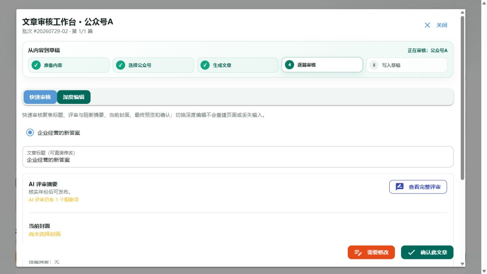
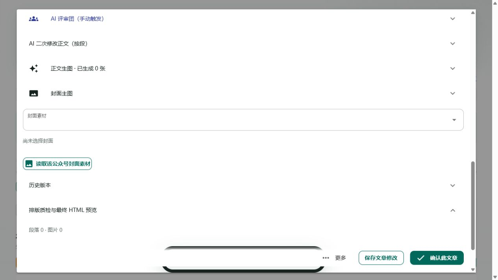
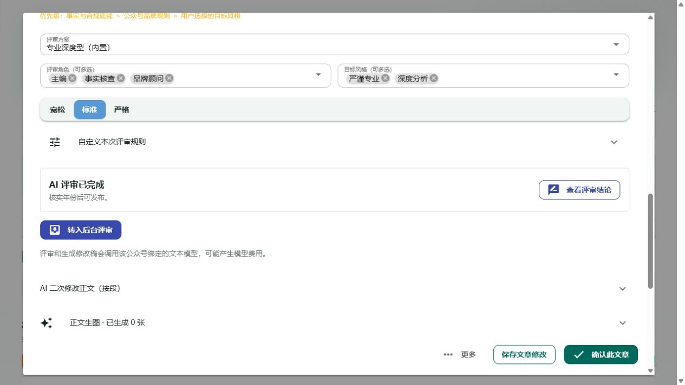
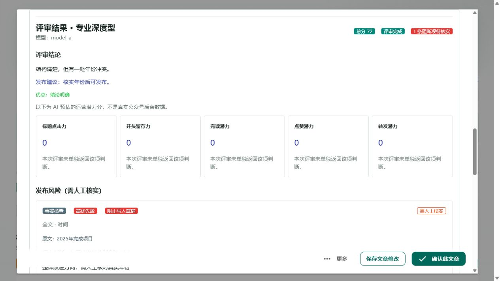
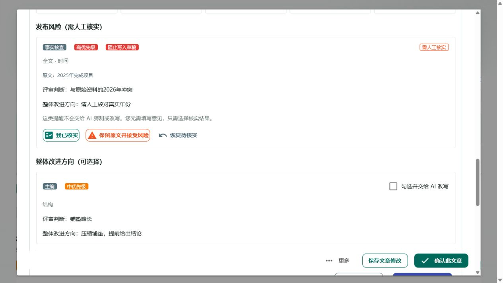
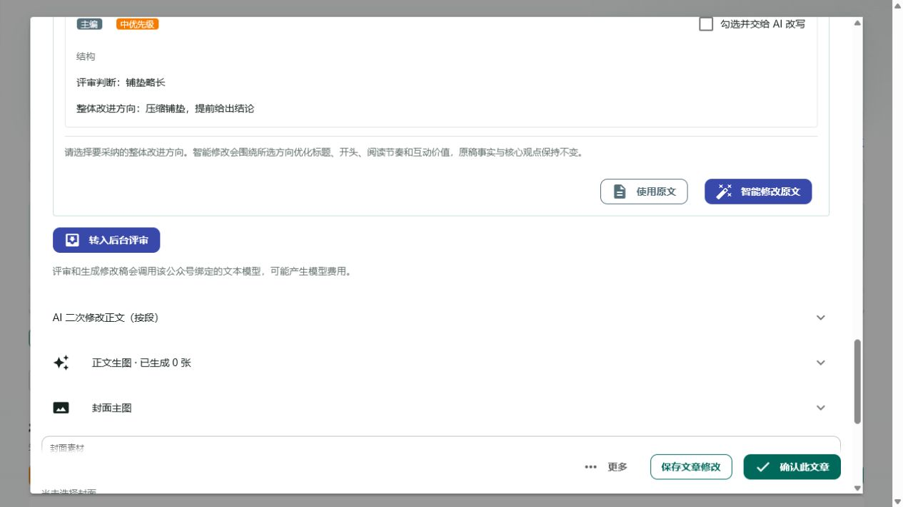
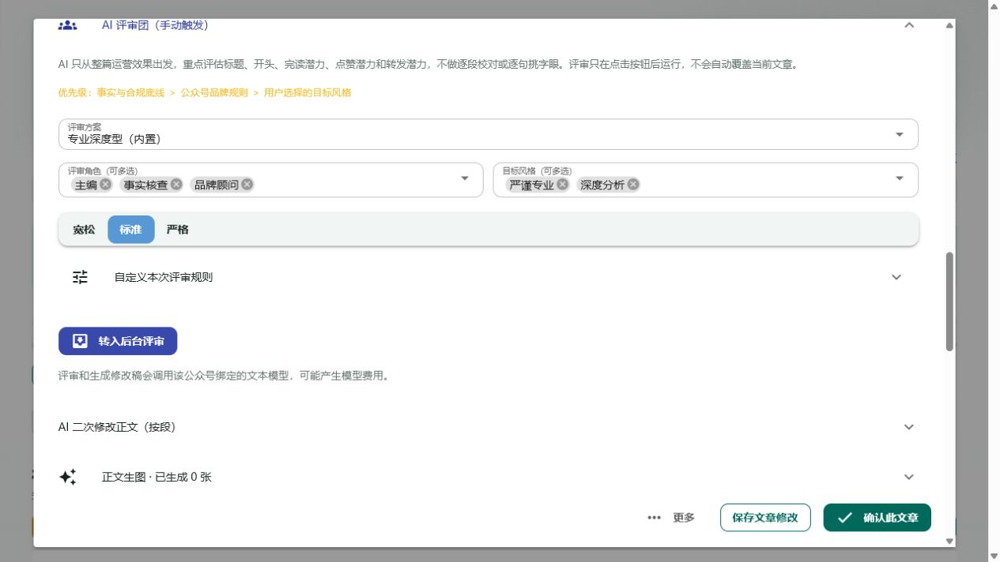

# AI 评审流程审计与优化建议

日期：2026-08-05
范围：文章审核工作台中的 AI 评审入口、评审设置、评审结果、风险处置、整篇改写和最终确认。
体验方式：使用一篇未评审文章和一篇已有完整评审/阻断项的历史文章进行真实前端只读体验；未重新发起模型调用，未修改文章、风险状态或公众号草稿。

## 一页结论

当前 AI 评审能力本身已经较完整，但页面没有围绕“开始评审 → 看结论 → 处理风险/采纳建议 → 确认文章”形成单一决策链。问题不只是按钮多，而是同一动作有多个入口、部分按钮没有实际业务结果、阻断状态没有反映到主操作、付费动作的文案也没有随状态变化。

建议先处理 3 项 P0：

1. **把“查看完整评审/查看评审结论”合并成一个入口**，一次点击直接展开并定位到评审结果。
2. **让阻断项和确认按钮联动**，有未核实阻断项时不得继续显示可用的“确认此文章”；风险按钮按当前状态显示。
3. **删除无结果按钮并重做评审启动文案**：移除仅弹提示的“使用原文”；首次评审显示“开始 AI 评审”，已有结果显示“重新评审”，重新评审前明确二次模型调用。

## 当前流程与健康度

| 步骤 | 健康度 | 实际体验 | 主要摩擦 |
| --- | --- | --- | --- |
| 1. 快速审核查看 AI 摘要 | 一般 | 可看到摘要和阻断数 | “查看完整评审”会切到深度编辑并滚动，但评审面板仍折叠，需要再点一次 |
| 2. 首次打开评审设置 | 一般 | 方案、角色、风格和严格度完整 | 主按钮在配置之后；按钮叫“转入后台评审”，把执行方式当成了用户目标 |
| 3. 查看已完成评审 | 较差 | 结论、评分、风险和建议都集中在同一面板 | 页面同时存在“查看完整评审”和“查看评审结论”；已有结果仍显示“转入后台评审” |
| 4. 处理事实/合规风险 | 较差 | 能区分人工核实与 AI 可改写建议 | 待核实状态同时出现“恢复待核实”；有 1 个阻断项时“确认此文章”仍可点击 |
| 5. 选择是否改写 | 较差 | 可勾选建议并整篇改写 | “使用原文”只弹成功提示，不记录决定、不移动流程，也不改变按钮状态 |
| 6. 定点修改正文 | 一般 | 可按段修改，能力与整篇优化不同 | “AI 二次修改正文”和“智能修改原文”命名接近，运营人员不容易判断整篇/单段边界 |

## 证据

### 1. 快速审核有阻断项，但确认按钮仍可用

- 实际体验：页面显示“AI 评审仍有 1 个阻断项”，底部“确认此文章”仍处于可点击状态。
- 代码发现：后端 `assert_job_may_confirm` 会拒绝确认，但前端没有把这一判定提前映射为禁用状态，导致用户先点击、后报错。

### 2. “查看完整评审”没有直接打开结果

- 实际体验：点击后切换到深度编辑并定位到 AI 评审区域，但面板保持折叠。
- 代码发现：`reveal_deep_review` 只切换模式并滚动到 `review_jury_host`，没有展开评审面板或调用结果定位。

### 3. 已完成评审仍显示再次启动按钮

- 实际体验：状态已是“AI 评审已完成”，仍显示“查看评审结论”和“转入后台评审”。
- 代码发现：评审启动按钮不区分首次、完成、失败、过期状态；已有结果时再次点击仍会调用模型。

### 4. 运营潜力未返回却显示 0 分

- 实际体验：五项都写着“未单独返回该项判断”，但同时显示 0 分，容易被理解成真实差评。
- 代码发现：维度分数统一使用 `score or 0` 渲染，缺失值和真实 0 分没有区分。

### 5. 风险处置按钮与状态冲突

- 实际体验：风险当前是“需人工核实”，但“恢复待核实”仍显示且可点击。
- 代码发现：三个风险按钮无条件渲染，没有根据 `resolution` 控制可见性。

### 6. “使用原文”是无业务结果按钮

- 代码发现：`use_original` 只显示“已保留原文”的提示，没有保存状态、清空选择、定位到最终确认或刷新任务状态。
- 结论：这是应直接删除或补成真实流程动作的功能缺陷，不是单纯视觉冗余。

### 7. 首次评审的主动作语义不清

- 实际体验：用户目标是“开始评审”，按钮却写“转入后台评审”；费用说明是按钮下方弱提示。
- 风险：用户无法区分首次评审和重新评审，也不容易预判再次点击会产生新的模型调用。

## 优化清单

### P0-1 合并评审结果入口

**问题**：快速摘要的“查看完整评审”和面板内的“查看评审结论”指向同一结果；第一次点击还不能直接看到结果。

**方案**：

- 快速审核只保留一个“查看评审结论”。
- 点击后一次完成：切换深度编辑、展开 AI 评审面板、展示并滚动到结果。
- 深度编辑顶部摘要保留结论文字，但移除第二个同义按钮。

**预期收益**：从摘要到结果由 2–3 次操作降为 1 次，减少“点了但没打开”的失控感。

**验收标准**：

- 有评审结果时，从快速审核点击一次即可在当前工作台看到“评审结果”标题和首条风险/建议。
- 同一页面不同时出现两个指向同一评审结果的 CTA。
- 切换模式不重建工作台，不丢失标题或正文输入。

### P0-2 阻断项与确认状态闭环

**问题**：页面显示 1 个阻断项，但“确认此文章”仍可点击；待核实风险还显示“恢复待核实”。

**方案**：

- `blocking_count > 0` 时禁用“确认此文章”，按钮文案改为“先处理 1 个阻断项”，旁边提供“去处理”定位到首条风险。
- 风险为 `open` 时只显示“我已核实”“保留原文并接受风险”。
- 风险为 `resolved/waived` 时显示处理结果、处理人/时间和唯一的“恢复待核实”。
- 处理结果保存后即时更新阻断数和底部确认状态。

**预期收益**：把后端拒绝提前变成前端指引，避免运营人员先失败一次才知道下一步。

**验收标准**：

- 有未处理阻断项时无法触发确认接口，前端明确显示剩余数量。
- `open` 状态不出现“恢复待核实”；已处理状态不再同时出现两个处理按钮。
- 最后一条阻断项处理成功后，阻断数变为 0，确认按钮恢复可用；刷新页面后状态一致。

### P0-3 删除无结果动作，重做评审启动状态

**问题**：“使用原文”是无状态变化的按钮；首次和再次评审都叫“转入后台评审”，且再次调用模型没有明确确认。

**方案**：

- 删除“使用原文”；不采纳建议就是保留原文，运营人员可直接进入最终确认。
- 未评审：按钮为“开始 AI 评审”。
- 评审中：按钮为不可重复点击的“AI 评审中”，显示任务进度入口。
- 已完成/失败/过期：按钮为“重新评审”；点击后弹出确认，明确会基于当前文章创建新评审并产生模型调用。
- “后台运行”只放在启动后的反馈和任务进度中，不作为主按钮名称。

**预期收益**：删除一个无效决策，避免误触重复评审和意外费用。

**验收标准**：

- 页面不存在只弹提示、但不改变流程或状态的主/次按钮。
- 首次、进行中、完成、失败、过期五类状态的按钮文案和可用性不同。
- 重新评审必须二次确认；取消后不创建评审记录、不调用模型。

### P1-1 缺失评分不显示 0

**方案**：`score` 缺失时显示“— / 未评估”，或整组隐藏并提示“旧版结果未返回运营潜力分”；只有模型明确返回 0 时才显示 0。

**验收标准**：缺失值、真实 0 分和正常分数三种数据在前端呈现不同；总分和维度分均遵循同一规则。

### P1-2 区分整篇优化与单段修改

**方案**：将“智能修改原文”改为“按所选建议优化整篇”；将“AI 二次修改正文（按段）”改为“AI 定点改写（单段）”，并在两个入口旁显示作用范围。

**验收标准**：运营人员在未展开详情前即可判断“整篇”与“单段”；两个动作都明确会调用模型、修改后需重新检查。

### P1-3 降低首次配置负担

**方案**：默认只显示“评审方案 + 严格度 + 开始评审”；角色、风格、自定义规则收进“调整本次评审设置”。

**验收标准**：使用默认方案时，进入深度编辑后最多一次展开、一次启动；主按钮无需滚动超过一屏才能看到。

### P1-4 修复可访问性与遮挡风险

**方案**：多选标签的移除按钮提供唯一中文名称（如“移除角色：事实核查”）；底部固定操作栏为正文预留同等高度的留白，避免覆盖结果和表单。

**验收标准**：键盘 Tab 可依次到达评审设置、风险处理和底部操作；屏幕阅读器可区分每个移除按钮；页面缩放至 200% 时最后一项结果不被操作栏遮挡。

### P2 登录后恢复深链接

**问题**：带 `view=review&batch_id=...&job_id=...` 的链接在登录后只进入任务中心，需要刷新才打开目标审核工作台。

**验收标准**：未登录用户打开审核深链接，登录成功后自动恢复到指定文章，且不会打开错误批次或重复弹窗。

## 建议的最终按钮模型

| 状态 | 面板主动作 | 结果区动作 | 底部文章动作 |
| --- | --- | --- | --- |
| 未评审 | 开始 AI 评审 | 无 | 确认此文章 / 需要修改 |
| 评审中 | AI 评审中（禁用）+ 查看进度 | 无 | 确认禁用并说明正在评审 |
| 已完成、无阻断 | 重新评审 | 按所选建议优化整篇 | 确认此文章 |
| 已完成、有阻断 | 重新评审 | 处理阻断项；可选整篇优化 | 先处理 N 个阻断项（禁用） |
| 已应用修改 | 重新评审 | 查看改写前后对比 | 重新检查并确认文章 |
| 评审失败/过期 | 重新评审 | 查看失败原因/过期原因 | 按其他校验结果决定是否可确认 |

## 证据边界

- “实际体验”来自 2026-08-05 的本地前端真实页面和当前数据；截图均为本轮新采集。
- “代码发现”用于确认按钮行为和后端拦截逻辑；本轮没有修改代码。
- 为避免费用和数据变更，未点击“转入后台评审/重新评审”“我已核实”“接受风险”“智能修改原文”和“确认此文章”。
- 未完成真实模型调用、窄屏响应式、全键盘操作或屏幕阅读器测试；可访问性项是基于可见界面与 DOM 名称的风险，需要实现后专项验证。
