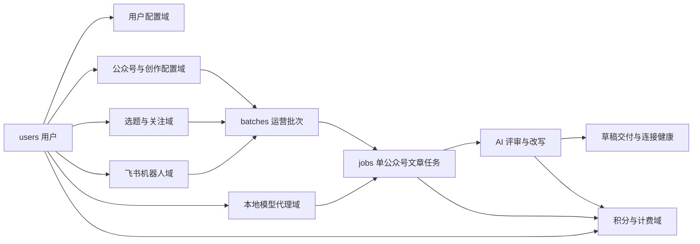
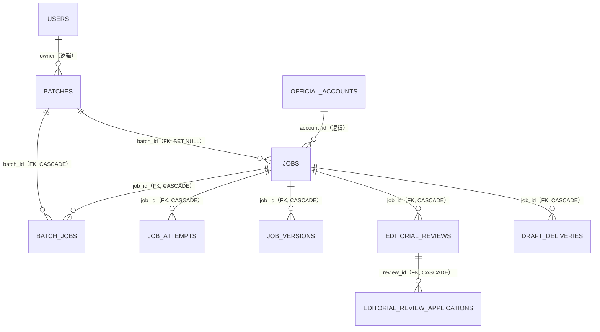
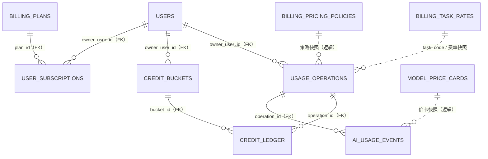
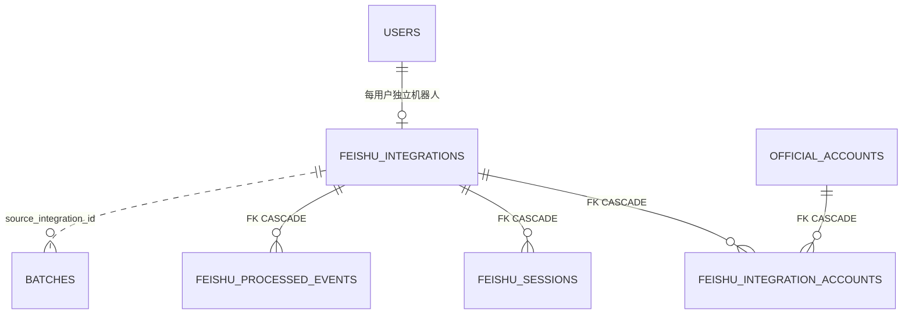

# 公众号智能运营助手：数据库表设计与关系说明

> 版本：2026-08-26；设计基线：`main@5759c03`，并以本地 PostgreSQL 实例的 `public` 元数据交叉核对；当前正式结构：47 张表（含 `schema_migrations`）。
> 适用对象：产品、研发、测试、运维与数据治理人员

## 1. 一页结论

这套数据库不是按页面拆表，而是围绕一条完整的内容运营链路组织：

```text
用户与租户
  ├─ 公众号 / 模型 / 提示词 / 创作方案
  ├─ 选题与关注账号
  ├─ 批次 → 文章任务 → AI 评审 → 人工确认 → 草稿交付
  ├─ 飞书机器人 / 本地模型代理
  └─ 计费策略 → 用量操作 → AI 调用事件 → 积分冻结与结算
```

最重要的设计规则有四条：

1. **`users.id` 是租户隔离根节点。** 客户数据通常带 `owner_user_id`；业务读写必须经过当前登录用户作用域，不能用无作用域数据库连接读取客户表。
2. **`batches` 与 `jobs` 是内容生产主链。** 一个批次代表一次运营动作，一个任务代表该批次投放到一个公众号后产生的一篇文章。
3. **计费分为“业务操作”和“物理调用”两层。** `usage_operations` 记录一次生成/评审等业务动作，`ai_usage_events` 记录该动作内部的一次或多次真实模型调用，积分则由 `credit_buckets` 与 `credit_ledger` 结算。
4. **外键与逻辑关联并存。** 强生命周期关系使用 PostgreSQL 外键；需要保留历史快照、兼容旧数据或跨模块解耦的关系只保存 ID，由服务层校验。本文会明确标注两者，不能把“同名 ID 字段”都理解为数据库外键。

## 2. 文档范围与证据边界

### 2.1 本文依据

- `app/schema_migrations.py` 中 `0001`—`0008` 的迁移定义；
- `app/db.py` 的读写方法、用户作用域校验和事务实现；
- `app/services/` 中批次、AI 评审、飞书、计费等业务服务；
- 当前本地 PostgreSQL 的表、列、主键、唯一约束、外键和索引元数据；
- 当前 `main` 分支代码调用关系。

`0008` 是计费任务费率的数据更新，不新增表，因此代码应用到 `0008` 前后物理表数量都仍为 47。

### 2.2 截图中的 `credit_tickets` 差异

用户截图显示 48 张表，其中多出 `credit_tickets`。但在本次核对中：

- 当前 `main` 的迁移、业务代码、测试和 Git 历史均没有 `credit_tickets`；
- 当前本地 PostgreSQL 也没有这张表；
- 当前正式积分实现使用 `credit_buckets`、`credit_ledger` 和 `usage_operations`，不依赖 `credit_tickets`。

因此本文不把 `credit_tickets` 编入正式数据模型。它更可能是截图所连接环境中的试验表、手工表或未清理遗留表。**不要直接删除**；应先在该环境读取表结构、行数、创建时间、依赖视图/触发器并备份，再决定归档或下线。

## 3. 全局设计约定

### 3.1 主键与标识

| 类型 | 当前做法 | 原因 |
|---|---|---|
| 用户、配置、批次、评审、计费等 ID | `TEXT`，应用层生成 UUID/语义 ID | 兼容既有 SQLite 数据和跨服务生成 |
| 文章任务、任务尝试、任务版本 | `BIGINT` | 任务链形成较早，沿用自增数值主键 |
| 映射表 | 单列主键或复合主键 | 防止同一关系重复写入 |
| 幂等对象 | 业务唯一键或复合唯一约束 | 防止飞书重放、草稿重复写入、模型回调重复计费 |

### 3.2 公共字段

- `owner_user_id`：客户数据归属。绝大多数查询都必须带当前用户条件。
- `created_at` / `updated_at` / `completed_at`：当前为 ISO-8601 文本时间，统一使用 UTC。
- `enabled`、`is_default` 等：历史兼容原因使用 `INTEGER` 的 `0/1`，业务层解释为布尔值。
- `*_json`：当前以 `TEXT` 保存 JSON 快照或灵活配置。写入前由应用序列化，读取后由服务层解析。
- `*_encrypted`：密文，不是明文凭证。公众号 Secret、模型 API Key、飞书 Secret/Token/Encrypt Key 都只能经密钥服务解密。
- `*_micro_cny`：人民币微元，`1 CNY = 1,000,000 micro_cny`，避免浮点误差。
- `*_fen`：人民币分；`*_basis_points`：基点，`10,000 = 100%`；`*_points`：平台整数积分。

### 3.3 三类关联

| 标记 | 含义 | 典型例子 |
|---|---|---|
| **FK** | PostgreSQL 外键强制完整性 | `jobs.batch_id → batches.id` |
| **逻辑关联** | 保存 ID，但由服务层校验归属和存在性 | `jobs.account_id → official_accounts.id` |
| **快照关联** | 保存来源 ID，同时保留名称、配置或正文快照，源数据变化不改写历史 | `jobs.account_name_snapshot`、`editorial_reviews.config_json` |

逻辑关联不等于“没有约束”。它通常还受到用户作用域、服务校验、唯一索引和状态机的共同限制，只是不由数据库外键直接阻止删除。

## 4. 总体关系图



### 4.1 内容生产主链



### 4.2 计费主链



## 5. 逐表设计说明

### 5.1 用户、会话与全局设置（4 张）

| 表 | 主键 / 唯一约束 | 关键关联 | 作用与生命周期 |
|---|---|---|---|
| `users` | PK `id`；UK `username` | 所有客户域数据的租户根节点 | 保存用户名、密码哈希、角色和启用状态。禁用用户不等于删除其业务数据。 |
| `user_sessions` | PK `token_hash` | **FK** `user_id → users.id`，级联删除 | 登录会话。只保存 Token 哈希、过期时间和最后活跃时间，不保存明文 Token。 |
| `user_settings` | 复合 PK `(user_id, key)` | **FK** `user_id → users.id`，级联删除 | 用户级键值设置；适合低频、小体量的个性化开关，不承载大型业务对象。 |
| `app_settings` | PK `key` | 平台级，无用户归属 | 全应用共享配置。仅适合非客户私有、非复杂结构的设置。 |

### 5.2 模型、公众号与创作配置（8 张）

| 表 | 主键 / 唯一约束 | 关键关联 | 作用与生命周期 |
|---|---|---|---|
| `ai_models` | PK `id` | `owner_user_id → users.id` **逻辑关联**；`local_agent_id → local_model_agents.id` **逻辑关联** | 每个用户可配置自己的云模型或本地模型。保存提供商、模型名、密文 API Key、Token 计量能力和启用状态。 |
| `official_accounts` | PK `id` | `owner_user_id` **逻辑关联**；`model_id → ai_models.id` **逻辑关联**；默认方案/评审配置使用 **FK SET NULL** | 公众号主档。保存 AppID、密文 Secret、默认模型、排版、评审优先级及默认创作/评审方案。 |
| `prompt_templates` | PK `id` | `owner_user_id` **逻辑关联** | 用户自定义文章或图片提示词模板。通过 `purpose` 区分用途。 |
| `creation_plans` | PK `id` | `owner_user_id` **逻辑关联**；提示词和评审方案为 **逻辑关联** | 可复用的创作方案，组合文章提示词、图片提示词、排版参数、图片参数和评审方案。 |
| `account_creation_plan_defaults` | PK `account_id` | **FK** 公众号级联删除；**FK** 创作方案删除时置空 | 公众号默认创作方案的兼容/规范化映射。用于保留旧调用契约，与 `official_accounts.default_creation_plan_id` 同步。 |
| `creation_plan_account_templates` | 复合 PK `(creation_plan_id, account_id)` | 两端均为 **FK CASCADE** | 保存“创作方案在某个公众号中的模板采样/占位配置”，包括来源 AppID、标题、素材 ID、HTML 快照及 SHA-256。 |
| `editorial_review_profiles` | PK `id` | `owner_user_id` **逻辑关联** | AI 评审规则模板。`config_json` 保存维度、阈值和评审行为，供多个公众号/创作方案复用。 |
| `account_editorial_review_defaults` | PK `account_id` | **FK** 公众号级联删除；**FK** 评审方案删除时置空 | 公众号默认评审配置的兼容/规范化映射，同时保存公众号级覆盖配置。 |

配置选择优先级为：**任务/请求显式选择 → 公众号默认 → 创作方案默认 → 平台兜底**。评审与生成任务开始后会把关键名称和配置复制为快照，避免后续修改配置污染历史结果。

### 5.3 内容生产、评审与草稿交付（10 张）

| 表 | 主键 / 唯一约束 | 关键关联 | 作用与生命周期 |
|---|---|---|---|
| `batches` | PK `id`；`display_id` 用于界面展示 | `owner_user_id` **逻辑关联**；`parent_batch_id` 自关联；`source_integration_id → feishu_integrations.id` **逻辑关联** | 一次运营动作的根记录。保存主题、来源、原文、改写强度、发起渠道、状态、错误和归档信息。重试/派生任务可用父批次追溯。 |
| `jobs` | PK `id`（`BIGINT`） | **FK** `batch_id → batches.id`，删除批次时置空；`account_id`、`ad_id` 为 **逻辑关联** | 一篇文章面向一个公众号的生产任务，是正文、标题、HTML、封面、状态、进度、错误及发布结果的当前态主表。 |
| `batch_jobs` | 复合 PK `(batch_id, job_id)` | 两端均为 **FK CASCADE**；`account_id` **逻辑关联** | 批次到任务的关系表，同时保存公众号名称和审核状态。属于历史兼容读模型；当前主状态也保存在 `jobs`。 |
| `job_attempts` | PK `id`（`BIGINT`）；同一任务仅允许一个运行中尝试 | **FK** `job_id`、`batch_id`，均级联删除 | 记录每一次后台执行尝试、阶段、模型、租约、心跳、错误、重试时间。用于恢复卡死任务和分析失败原因。 |
| `job_versions` | PK `id`（`BIGINT`） | **FK** `job_id → jobs.id`，级联删除 | 文章版本历史。保存标题、摘要、正文、HTML、封面与变更原因，让 AI 改写或人工操作可回退。 |
| `editorial_reviews` | PK `id`；同一任务仅允许一个 `running/rewriting` 活跃评审 | **FK** `job_id`、`batch_id`；`profile_id` 为快照来源 | 一次 AI 评审主记录。保存评审输入快照、规则快照、结果、阻断数量、选中问题、改写结果和修订号。 |
| `editorial_review_applications` | PK `id` | **FK** `review_id → editorial_reviews.id`，级联删除 | 用户对评审结果执行“按问题改写、按段落改写”等动作的执行记录；保存选择范围、指令、候选稿、错误和应用时间。 |
| `draft_deliveries` | PK `idempotency_key`；UK `(job_id, account_id, content_revision, content_fingerprint)` | **FK** `job_id → jobs.id`，级联删除；`account_id` **逻辑关联** | 微信草稿写入的幂等账本。记录尝试次数、草稿 Media ID、错误码、重试/对账时间，防止同一正文重复写入。 |
| `wechat_connection_health` | PK `account_id` | `account_id → official_accounts.id` **逻辑关联** | 公众号连接能力缓存。区分探测模式、成功/失败、延迟、过期时间和最近成功写入时间，避免每个页面重复触发外部调用。 |
| `ads` | PK `id` | `jobs.ad_id → ads.id` **逻辑关联** | 可插入文章的推广内容库，含优先级、启用/过期状态和最近使用时间。文章任务保存选中的广告 ID。 |

#### `batches`、`jobs`、`batch_jobs` 为什么同时存在

- `batches`：回答“这次运营动作是什么、从哪里发起、整体进行到哪一步”。
- `jobs`：回答“某个公众号对应的这篇文章现在是什么内容和状态”。
- `batch_jobs`：回答“批次与任务如何映射，并兼容早期审核列表所需的关系快照”。

新功能应优先以 `jobs` 作为文章当前态来源，以 `batches` 作为聚合根；不要再向 `batch_jobs` 堆叠新的正文或复杂状态字段。

### 5.4 选题与关注账号（4 张）

| 表 | 主键 / 唯一约束 | 关键关联 | 作用与生命周期 |
|---|---|---|---|
| `topic_sources` | PK `id`；UK `(owner_user_id, source_key)` | `owner_user_id` **逻辑关联** | 用户配置的选题来源，例如 RSS、网页或其他采集源；保存采集配置、同步状态和错误。 |
| `topic_items` | PK `id`；UK `(source_id, title, url)` | **FK** `source_id → topic_sources.id`，级联删除 | 来源抓取后的候选选题，保存标题、链接、摘要、分类、收藏/已使用状态及原始响应快照。 |
| `followed_accounts` | PK `id` | `owner_user_id` **逻辑关联**；`official_account_id` **逻辑关联** | 用户关注的外部账号或自有公众号，保存抓取方式、样例链接、关键词、刷新周期和同步健康状态。 |
| `followed_articles` | PK `id`；UK `(owner_user_id, url)` | **FK** `followed_account_id`，删除关注账号时置空；`rewritten_batch_id → batches.id` **逻辑关联** | 已发现的外部文章。支持已读、收藏、忽略以及“已由哪个批次改写”的追踪。 |

`topic_*` 更偏通用选题源；`followed_*` 更偏按账号持续跟踪。两组数据的入口和运营语义不同，当前不应强行合并。

### 5.5 飞书机器人（7 张）



| 表 | 主键 / 唯一约束 | 关键关联 | 作用与生命周期 |
|---|---|---|---|
| `feishu_integrations` | PK `id`；UK `owner_user_id`；UK `app_id`；UK `callback_key` | `owner_user_id` **逻辑关联**；`agent_model_id` **逻辑关联** | 每个用户独立的飞书应用/机器人配置。唯一 `owner_user_id` 保证一个用户一套绑定；唯一 AppID 和回调键防止不同用户共用同一机器人入口。凭证全部密文保存。 |
| `feishu_integration_accounts` | 复合 PK `(integration_id, account_id)` | 两端均为 **FK CASCADE** | 明确某个飞书机器人能操作哪些公众号，并标记默认公众号。请求执行时仍会校验这些公众号归属于同一用户。 |
| `feishu_sessions` | 复合 PK `(integration_id, chat_id)` | **FK** `integration_id`，级联删除 | 每个机器人、每个会话的批次指针和上下文。复合主键防止不同用户/机器人之间串会话。 |
| `feishu_processed_events` | 复合 PK `(integration_id, event_id)` | **FK** `integration_id`，级联删除 | 飞书事件幂等表。同一事件只在所属机器人范围内处理一次。 |
| `bot_contexts` | PK `scope_id` | 旧式逻辑作用域 | 旧机器人通道的上下文 JSON。属于兼容表，新飞书能力不应继续扩展它。 |
| `bot_sessions` | PK `scope_id` | `batch_id → batches.id` **逻辑关联** | 旧机器人通道的会话到批次映射。属于兼容表。 |
| `processed_events` | PK `event_id` | 无用户列 | 通用/旧通道事件幂等记录，当前仍可能被微信侧 Agent 使用，不能仅因飞书已有新表就删除。 |

飞书隔离的核心不是只看 `chat_id`，而是每一次请求都沿着以下链路恢复用户作用域：

```text
callback_key / app_id
  → feishu_integrations.owner_user_id
  → Database.for_user(owner_user_id)
  → feishu_integration_accounts 中允许的公众号
  → batches.source_integration_id 留痕
```

### 5.6 本地模型代理（3 张）

| 表 | 主键 / 唯一约束 | 关键关联 | 作用与生命周期 |
|---|---|---|---|
| `local_agent_pairings` | PK `id`；设备码/用户码使用哈希 | `owner_user_id`、`agent_id` **逻辑关联** | 本地 Agent 配对流程的短期状态，保存过期、批准、领取和失败次数，避免保存明文配对码。 |
| `local_model_agents` | PK `id` | **FK** `owner_user_id → users.id`，级联删除 | 用户已绑定的本地执行器，保存 Token 哈希、在线状态、最后心跳、错误和撤销时间。 |
| `local_model_requests` | PK `id` | **FK** `model_id → ai_models.id`；`owner_user_id`、`agent_id` **逻辑关联** | 云端投递给本地 Agent 的请求队列。含请求、结果、租约、截止时间、幂等尝试和错误码，支持可靠领取与回传。 |

### 5.7 积分、订阅与 AI 用量（9 张）

| 表 | 主键 / 唯一约束 | 关键关联 | 作用与生命周期 |
|---|---|---|---|
| `billing_plans` | PK `id` | 被 `user_subscriptions.plan_id` 引用 | 套餐定义：月/年价格、周期积分、权益 JSON、版本和启用状态。当前是套餐账务模型，不等于已经接入支付渠道。 |
| `user_subscriptions` | PK `id` | **FK** `owner_user_id → users.id`，级联删除；**FK** `plan_id → billing_plans.id`，禁止误删被引用套餐 | 用户订阅状态、周期、续费标记、下次发放时间和外部订阅号。 |
| `billing_pricing_policies` | PK `id` | 由计费服务读取并写入操作快照 | 平台定价总策略：`off/shadow/live` 模式、积分价值、目标毛利、支付/税费、风险准备、平台固定成本、舍入和 BYOK 基础费。通过版本号支持审计。 |
| `billing_task_rates` | PK `task_code` | `usage_operations.task_code` 为逻辑关联并保存费率快照 | 生成、改写、评审、抓取等业务任务的固定基础积分和最大冻结积分。 |
| `model_price_cards` | PK `id`；按提供商、模型、模态和生效时间检索 | `ai_usage_events` 通过提供商/模型/模态匹配，事件保存完整价卡快照 | 模型资源成本价卡。支持 Token、固定请求、按单位、BYOK 等计量模式，以及生效区间和加价/风险参数。 |
| `usage_operations` | PK `id`；UK `(owner_user_id, idempotency_key)` | **FK** 用户；`job_id → jobs.id` 为 **FK SET NULL** | 一次可计费业务动作的总账头。保存场景、来源渠道、任务码、冻结/估算/实扣积分、定价快照、状态和完成时间。 |
| `ai_usage_events` | PK `id`；提供商请求/响应追踪号带用户维度去重 | **FK** 用户、用量操作；`job_id → jobs.id` **FK SET NULL**；`model_id` **逻辑关联** | 一次真实模型 API 调用的明细。记录 Token、图片/固定单位、来源、成本、计价结果、追踪号、成功/失败和是否计入最终结果。 |
| `credit_buckets` | PK `id` | **FK** `owner_user_id → users.id`，级联删除 | 每一笔积分发放形成一个独立批次，保存来源、发放量、剩余量和到期时间；扣减按临期优先，便于处理不同有效期。 |
| `credit_ledger` | PK `id`；冻结/释放等事件有操作维度幂等约束 | **FK** 用户；**FK** 积分批次和用量操作，默认禁止误删 | 不可变积分流水。`grant` 为正，`reserve` 为负，`release` 为正；结合操作表还原每次冻结、实扣和退回过程。 |

#### 为什么不用一张“用户余额表”

余额由有效 `credit_buckets.remaining_points` 汇总得到，而不是维护一个容易漂移的单值：

- 每笔积分可以有不同来源和到期时间；
- 冻结时按最早到期批次优先扣减；
- 结算后按规则释放差额；
- `credit_ledger` 提供审计轨迹；
- `usage_operations` 提供业务幂等和最终收费结果。

一次正式计费的事务流程为：

```text
1. 创建 usage_operations（running）
2. 按 billing_task_rates.max_reserve_points 冻结积分
3. 每次模型调用写 ai_usage_events，并固化 model_price_cards 快照
4. 汇总固定任务积分 + 实际资源积分
5. 更新 usage_operations 为 succeeded / failed / pricing_incomplete
6. 释放“冻结额 - 实扣额”的差值；超时操作按 0 实扣释放
```

`shadow` 模式只试算、不冻结/扣除；`off` 模式不创建计量操作；`live` 模式才执行真实积分冻结和结算。

### 5.8 缓存与数据库治理（2 张）

| 表 | 主键 / 唯一约束 | 关键关联 | 作用与生命周期 |
|---|---|---|---|
| `token_cache` | PK `key` | 无外键；Key 中带调用作用域 | 缓存微信公众号 Access Token 等短期 Token，保存密文/值和过期时间。不能将不同公众号共用同一个无作用域 Key。 |
| `schema_migrations` | PK `version`；保存 `checksum` | 无业务关联 | 记录迁移版本、名称、校验和和应用时间。启动时通过 PostgreSQL advisory lock 保证单实例执行，并拒绝同版本迁移内容被静默修改。 |

## 6. 关键业务流程如何落表

### 6.1 创建与生成文章

1. 用户从 `topic_items`、`followed_articles`、URL 或手工正文发起任务。
2. 创建 `batches`，保存本次运营动作的来源和参数。
3. 按选中的 `official_accounts` 创建多个 `jobs`，每个公众号一条。
4. `job_attempts` 记录后台阶段、租约、心跳和失败重试。
5. 使用 `ai_models`、`creation_plans`、`prompt_templates` 完成生成，结果回写 `jobs`。
6. 关键改写前后保存 `job_versions`，批次页通过 `batch_jobs` 兼容展示关系和审核状态。
7. 每个模型调用同时归入一个 `usage_operations` 并写入 `ai_usage_events`。

### 6.2 AI 评审与后台改写

1. 对 `jobs` 当前内容创建 `editorial_reviews`，固化规则和原文快照。
2. 评审完成后保存风险项、分数和阻断数；用户的选择写回主评审记录。
3. 用户选择问题或段落发起改写时，创建 `editorial_review_applications`。
4. 后台任务继续执行时页面可以离开；进度由评审/应用记录的状态和结果驱动。
5. 应用候选稿前校验 `source_hash`，避免用户在评审后又改了正文却覆盖新内容。
6. 正式应用时形成 `job_versions`，再更新 `jobs` 的当前正文和修订号。

### 6.3 写入微信公众号草稿

1. 人工确认后，按 `jobs.account_id` 找到所属 `official_accounts`。
2. 先读取 `wechat_connection_health`，必要时刷新连接探测。
3. 用任务、公众号、内容修订号和指纹生成草稿幂等键。
4. `draft_deliveries` 先记录写入尝试，再调用微信接口。
5. 成功后保存 `draft_media_id`，失败则保存结构化错误、重试时间和对账状态。

### 6.4 飞书指挥文章工作

1. 回调通过唯一 `callback_key` 或 AppID 找到 `feishu_integrations`。
2. 恢复 `owner_user_id` 后创建用户作用域数据库句柄。
3. 使用 `feishu_processed_events` 在“机器人 + 事件”范围去重。
4. 使用 `feishu_sessions` 在“机器人 + 会话”范围恢复上下文。
5. 只允许访问 `feishu_integration_accounts` 中绑定且归属于同一用户的公众号。
6. 生成的 `batches` 保存 `source_integration_id`，后续可审计由哪个机器人发起。

## 7. 删除、保留与级联规则

| 场景 | 数据库行为 | 设计目的 |
|---|---|---|
| 删除用户 | 会话、订阅、积分批次、用量事件等强归属表级联；其他客户表仍需走业务清理流程 | 防止孤立鉴权/账务子表，同时避免一条 SQL 误删全部内容生产历史 |
| 删除批次 | `batch_jobs`、`job_attempts`、`editorial_reviews` 级联；`jobs.batch_id` 置空 | 文章任务可保留为独立历史，关系/执行明细随聚合根清理 |
| 删除任务 | 尝试、版本、评审、草稿交付级联 | 子记录脱离任务没有独立业务价值 |
| 删除公众号 | 默认配置映射和方案模板映射级联 | 清理强绑定配置；历史任务仍用账号 ID/名称快照保留事实 |
| 删除评审 | 改写应用级联 | 应用记录只能依附其来源评审 |
| 删除积分批次/用量操作 | 有流水引用时默认拒绝 | 账务审计记录不能被级联抹掉 |
| 删除选题源 | 选题项级联 | 抓取结果依赖来源配置 |
| 删除关注账号 | 文章的 `followed_account_id` 置空 | 保留已抓取文章和历史改写记录 |

所有生产删除动作仍应通过服务层完成，不能把数据库的 `CASCADE` 当成通用清理接口。

## 8. 用户隔离与敏感数据安全

### 8.1 用户作用域

以下表直接或间接属于用户：模型、公众号、提示词、创作方案、评审方案、批次、任务、选题源、关注账号/文章、飞书、本地 Agent、订阅、积分和用量。

强制规则：

- 登录后使用 `Database.for_user(user_id)`、`set_owner_user(...)` 或等价的 `customer_data_scope(...)`；
- 创建子记录时不能信任前端传入的 `owner_user_id`，必须从当前会话继承；
- 通过 `job_id`、`batch_id`、`account_id` 读取子表前，先校验根对象属于当前用户；
- 管理员跨用户统计必须使用专门的 admin 查询，不得把普通用户查询“去掉 WHERE”复用；
- 飞书和本地 Agent 的身份恢复后必须立即进入该用户作用域，再处理业务参数。

### 8.2 敏感字段

| 数据 | 保存方式 | 不允许的做法 |
|---|---|---|
| 用户密码 | 强哈希 `password_hash` | 明文或可逆加密密码 |
| 公众号 Secret | `app_secret_encrypted` | 日志打印、接口原样返回 |
| 模型 API Key | `api_key_encrypted` | 放入任务 JSON 或用量原始响应 |
| 飞书凭证 | 多个 `*_encrypted` 字段 | 跨用户复用一套机器人配置 |
| 登录/Agent Token | 只保存 Token 哈希 | 数据库保存明文 Token |
| 模型原始用量 | `raw_usage_json` 只保留计量所需的脱敏字段 | 保存完整提示词、正文或提供商敏感响应 |

## 9. 当前兼容表与演进边界

下列表看起来有重复，但暂时承担兼容职责，不能直接合并或删除：

| 当前重复点 | 权威来源 | 兼容来源 | 演进建议 |
|---|---|---|---|
| 公众号默认创作方案 | `official_accounts.default_creation_plan_id` | `account_creation_plan_defaults` | 保持双写/回填，所有消费者迁移后再单独下线 |
| 公众号默认评审方案 | `official_accounts.default_editorial_review_profile_id` + 配置 JSON | `account_editorial_review_defaults` | 先统一读写服务，再收敛物理表 |
| 批次任务及审核状态 | `jobs.batch_id/account_id/review_status` | `batch_jobs` | 新字段只加到 `jobs`，旧查询逐步迁移 |
| 飞书上下文/幂等 | `feishu_sessions`、`feishu_processed_events` | `bot_contexts`、`bot_sessions`、`processed_events` | 先按调用方逐项清点，不能一次性删除旧表 |

## 10. 后续数据库优化建议

这些建议不会改变现有功能，适合按独立迁移分期实施：

### P0：先保持现状并补治理

- 把本文 47 张表作为当前基线，任何新增/删除表必须通过带 checksum 的迁移。
- 在截图所连接环境完成 `credit_tickets` 的只读审计，确认无依赖后再决定归档。
- 对没有数据库外键的 `owner_user_id` 持续保留服务层作用域测试，尤其覆盖普通用户、第二管理员和飞书回调。

### P1：减少逻辑关联风险

- 为 `ai_models.local_agent_id`、`official_accounts.model_id`、`jobs.account_id` 等高价值逻辑关联建立“孤儿数据审计”，先报告、不自动删除。
- 为所有 `owner_user_id + 常用排序/筛选列` 检查复合索引，避免客户数据增长后出现全表扫描。
- 给账务流水建立定期对账：积分批次余额、流水净额、操作冻结/实扣三方一致。

### P2：逐步类型现代化

- 在兼容验证完成后，把新表优先改为 PostgreSQL 原生 `TIMESTAMPTZ`、`BOOLEAN`、`JSONB`；旧表不要一次性大迁移。
- 对稳定枚举增加 `CHECK` 约束，例如计费模式、操作状态和流水事件类型。
- 只有在读写调用全部收敛后，才删除 `batch_jobs`、`account_*_defaults` 或旧机器人兼容表。

## 11. 表数量核对清单

| 数据域 | 数量 | 表 |
|---|---:|---|
| 用户、会话与全局设置 | 4 | `users`、`user_sessions`、`user_settings`、`app_settings` |
| 模型、公众号与创作配置 | 8 | `ai_models`、`official_accounts`、`prompt_templates`、`creation_plans`、`account_creation_plan_defaults`、`creation_plan_account_templates`、`editorial_review_profiles`、`account_editorial_review_defaults` |
| 内容生产、评审与草稿交付 | 10 | `batches`、`jobs`、`batch_jobs`、`job_attempts`、`job_versions`、`editorial_reviews`、`editorial_review_applications`、`draft_deliveries`、`wechat_connection_health`、`ads` |
| 选题与关注账号 | 4 | `topic_sources`、`topic_items`、`followed_accounts`、`followed_articles` |
| 飞书机器人 | 7 | `feishu_integrations`、`feishu_integration_accounts`、`feishu_sessions`、`feishu_processed_events`、`bot_contexts`、`bot_sessions`、`processed_events` |
| 本地模型代理 | 3 | `local_agent_pairings`、`local_model_agents`、`local_model_requests` |
| 积分、订阅与 AI 用量 | 9 | `billing_plans`、`user_subscriptions`、`billing_pricing_policies`、`billing_task_rates`、`model_price_cards`、`usage_operations`、`ai_usage_events`、`credit_buckets`、`credit_ledger` |
| 缓存与数据库治理 | 2 | `token_cache`、`schema_migrations` |
| **合计** | **47** | 不含截图中的未确认表 `credit_tickets` |

---

本文描述的是当前可由代码、迁移和 PostgreSQL 元数据共同证明的正式结构。若生产库元数据与本文不同，应先以只读方式导出 `information_schema`、约束、索引和迁移版本进行差异审计，不能直接用本文结构覆盖生产库。
